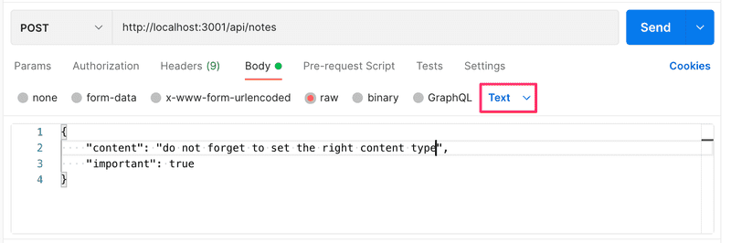
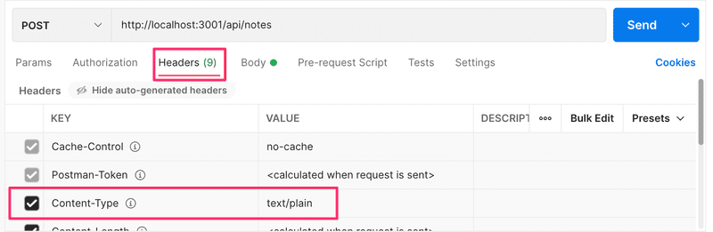

# Receiving data

Next, let's make it possible to add new notes to the server. Adding a note happens by making an HTTP `POST` request to the address http://localhost:3001/api/notes, and by sending all the information for the new note in the request body in the **JSON** format.

- In order to access the data easily, we need the help of the express `json-parser` that is taken to use with command `app.use(express.json())`.

- Let's activate the json-parser and implement an initial handler for dealing with the HTTP POST requests:

```js
const express = require("express");
const app = express();

app.use(express.json());

//...

app.post("/api/notes", (request, response) => {
  const note = request.body;
  console.log(note);
  response.json(note);
});
```

- The event handler function can access the data from the `body` property of the `request` object.

- Without the _json-parser_, the `body` property would be undefined. **The _json-parser_ functions so that it takes the JSON data of a request, transforms it into a JavaScript object and then attaches it to the body property of the request object before the route handler is called**.

- For the time being, the application does not do anything with the received data besides printing it to the console and sending it back in the response.

- Before we implement the rest of the application logic, let's verify with Postman that the data is actually received by the server. In addition to defining the URL and request type in Postman, we also have to define the data sent in the body:


- The application prints the data that we sent in the request to the console:


- NB Keep the terminal running the application visible at all times when you are working on the backend. Thanks to Nodemon any changes we make to the code will restart the application. If you pay attention to the console, you will immediately be able to pick up on errors that occur in the application:

- Similarly, it is useful to check the console for making sure that the backend behaves like we expect it to in different situations, like when we send data with an HTTP POST request. Naturally, it's a good idea to add lots of console.log commands to the code while the application is still being developed.

- A potential cause for issues is an incorrectly set Content-Type header in requests. This can happen with Postman if the type of body is not defined correctly:



- The Content-Type header is set to text/plain:



- The server appears to only receive an empty object:


- The server will not be able to parse the data correctly without the correct value in the header. It won't even try to guess the format of the data, since there's a massive amount of potential Content-Types.

- Postman also allows users to save requests, but the situation can get quite chaotic especially when you're working on multiple unrelated projects.

## Important sidenote

- Sometimes when you're debugging, you may want to find out what headers have been set in the HTTP request. One way of accomplishing this is through the `get` method of the <a href="https://expressjs.com/en/4x/api.html#req.get" target="_blank">request object</a>, that can be used for getting the value of a single header. The request object also has the headers property, that contains all of the headers of a specific request.

- Problems can occur with the VS REST client if you accidentally add an empty line between the top row and the row specifying the HTTP headers. In this situation, the REST client interprets this to mean that all headers are left empty, which leads to the backend server not knowing that the data it has received is in the JSON format.

- You will be able to spot this missing 'Content-Type' header if at some point in your code you print all of the request headers with the console.log(request.headers) command.

<hr>

- Let's return to the application. Once we know that the application receives data correctly, it's time to finalize the handling of the request:

```js
app.post('/api/notes', (request, response) => {
  const maxId = notes.length > 0
    ? Math.max(...notes.map(n => n.id)) 
    : 0

  const note = request.body
  note.id = maxId + 1

  notes = notes.concat(note)

  response.json(note)
})
```

- We need a unique id for the note. First, we find out the largest id number in the current list and assign it to the `maxId` variable. The id of the new note is then defined as `maxId + 1`. **This method is in fact not recommended, but we will live with it for now as we will replace it soon enough**.

- The current version still has the problem that the `HTTP POST `request can be used to add objects with arbitrary properties. Let's improve the application by defining that the content property may not be empty. The important and date properties will be given default values. All other properties are discarded:

```js
const generateId = () => {
  const maxId = notes.length > 0
    ? Math.max(...notes.map(n => n.id))
    : 0
  return maxId + 1
}

app.post('/api/notes', (request, response) => {
  const body = request.body

  if (!body.content) {
    return response.status(400).json({ 
      error: 'content missing' 
    })
  }

  const note = {
    content: body.content,
    important: body.important || false,
    date: new Date(),
    id: generateId(),
  }

  notes = notes.concat(note)

  response.json(note)
})
```

- The logic for generating the new id number for notes has been extracted into a separate `generateId` function.

- If the received data is missing a value for the `content` property, the server will respond to the request with the status code <a href="https://www.rfc-editor.org/rfc/rfc9110.html#name-400-bad-request" target="_blank">400</a> bad request:

```js
if (!body.content) {
  return response.status(400).json({ 
    error: 'content missing' 
  })
}
```

- Notice that calling return is crucial, because otherwise the code will execute to the very end and the malformed note gets saved to the application.

- If the `content` property has a value, the note will be based on the received data. As mentioned previously, it is better to generate timestamps on the server than in the browser, since we can't trust that host machine running the browser has its clock set correctly. The generation of the `date` property is now done by the server.

- If the `important` property is missing, we will default the value to `false`. The default value is currently generated in a rather odd-looking way:

```js
important: body.important || false,
```

- If the data saved in the `body` variable has the `important` property, the expression will evaluate to its value. If the property does not exist, then the expression will evaluate to `false` which is defined on the right-hand side of the vertical lines.


