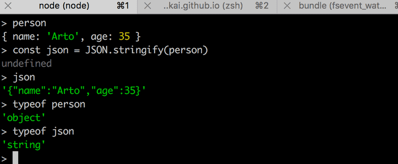

# Web and Express

Let's get back to our application and make the following changes:

```js
const express = require('express')
const app = express()

let notes = [
  ...
]

app.get('/', (request, response) => {
  response.send('<h1>Hello World!</h1>')
})

app.get('/api/notes', (request, response) => {
  response.json(notes)
})

const PORT = 3001
app.listen(PORT, () => {
  console.log(`Server running on port ${PORT}`)
})
```

- The application did not change a whole lot. Right at the beginning of our code we're importing **express**, which this time is a `function` that is used to create an express application stored in the `app` variable:

```js
const express = require('express')
const app = express()
```

- Next, we define two routes to the application. The first one defines an event handler that is used to handle HTTP GET requests made to the application's / root:

```js
app.get('/', (request, response) => {
  response.send('<h1>Hello World!</h1>')
})
```

- The event handler function accepts two parameters. The first `request` parameter contains all of the information of the HTTP request, and the second `response` parameter is used to define how the request is responded to.

- In our code, the request is answered by using the `send` method of the response object. Calling the method makes the server respond to the HTTP request by sending a response containing the string `<h1>Hello World!</h1>`that was passed to the send method. 

- Since the parameter is a string, express automatically sets the value of the `Content-Type` header to be `text/html`. The status code of the response defaults to 200.

- We can verify this from the Network tab in developer tools:


- The second route defines an event handler that handles HTTP GET requests made to the **notes** path of the application:

```js
app.get('/api/notes', (request, response) => {
  response.json(notes)
})
```

- The request is responded to with the `json` method of the `response` object. Calling the method will send the **notes** array that was passed to it as a JSON formatted string. **Express automatically sets the Content-Type header with the appropriate value of application/json**.

## Moving on

- In the earlier version where we were only using Node, we had to transform the data into the JSON format with the JSON.stringify method:

```js
response.end(JSON.stringify(notes))
```

- With express, this is no longer required, because this transformation happens automatically.

- It's worth noting that JSON is a `string`, and not a JavaScript object like the value assigned to notes.



- The experiment above was done in the interactive `node-repl`. You can start the interactive node-repl by typing in `node` in the command line. The repl is particularly useful for testing how commands work while you're writing application code.

