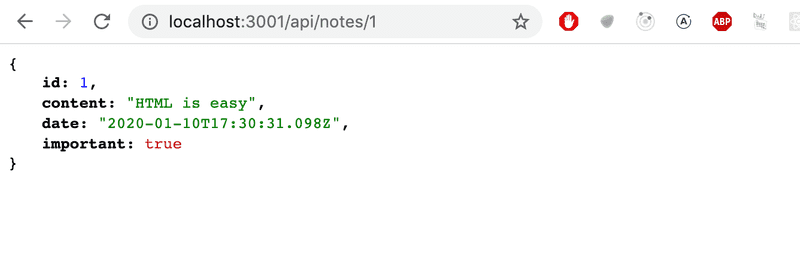
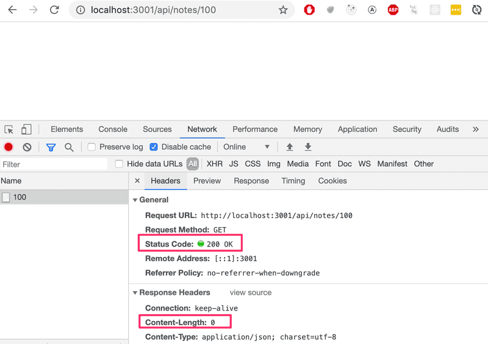

# Fetching a single resource

Let's expand our application so that it offers a REST interface for operating on individual notes. First let's create a <a href="https://expressjs.com/en/guide/routing.html" target="_blank">route</a> for fetching a single resource.

The unique address we will use for an individual note is of the form `notes/10`, where the number at the end refers to the note's unique id number.

We can define <a href="https://expressjs.com/en/guide/routing.html#route-parameters" target="_blank">parameters</a> for routes in express by using the colon syntax:

```js
app.get('/api/notes/:id', (request, response) => {
  const id = request.params.id
  const note = notes.find(note => note.id === id)
  response.json(note)
})
```

- Now `app.get('/api/notes/:id', ...)` will handle all HTTP GET requests that are of the form */api/notes/SOMETHING*, where *SOMETHING* is an arbitrary string.

- The `id` parameter in the route of a request, can be accessed through the `request` object:

```js
const id = request.params.id
```

- The now familiar `find` method of arrays is used to find the note with an `id` that matches the parameter. The note is then returned to the sender of the request.

- When we test our application by going to http://localhost:3001/api/notes/1 in our browser, we notice that it does not appear to work, as the browser displays an empty page. This comes as no surprise to us as software developers, and it's time to debug.

- Adding console.log commands into our code is a time-proven trick:

```js
app.get('/api/notes/:id', (request, response) => {
  const id = request.params.id
  console.log(id)
  const note = notes.find(note => note.id === id)
  console.log(note)
  response.json(note)
})
```

- When we visit http://localhost:3001/api/notes/1 again in the browser, the console which is the terminal in this case, will display the following:


- The `id` parameter from the route is passed to our application but the `find` method does not find a matching note.

- To further our investigation, we also add a `console log` inside the comparison function passed to the `find` method. In order to do this, we have to get rid of the compact arrow function syntax `note => note.id === id`, and use the syntax with an explicit return statement:

```js
app.get('/api/notes/:id', (request, response) => {
  const id = request.params.id
  const note = notes.find(note => {
    console.log(note.id, typeof note.id, id, typeof id, note.id === id)
    return note.id === id
  })
  console.log(note)
  response.json(note)
})
```

- When we visit the URL again in the browser, each call to the comparison function prints a few different things to the console. The console output is the following:

```
1 'number' '1' 'string' false
2 'number' '1' 'string' false
3 'number' '1' 'string' false
```

- The cause of the bug becomes clear. The id variable contains a string '1', whereas the ids of notes are integers. In JavaScript, the "triple equals" comparison === considers all values of different types to not be equal by default, meaning that 1 is not '1'.

- Let's fix the issue by changing the id parameter from a **string** into a **number**:

```js
app.get('/api/notes/:id', (request, response) => {
  const id = Number(request.params.id)
  const note = notes.find(note => note.id === id)
  response.json(note)
})
```

- Now fetching an individual resource works.



- However, there's another problem with our application.

- If we search for a note with an id that does not exist, the server responds with:



- The HTTP status code that is returned is 200, which means that the response succeeded. There is no data sent back with the response, since the value of the content-length header is 0, and the same can be verified from the browser.

- The reason for this behavior is that the note variable is set to undefined if no matching note is found. The situation needs to be handled on the server in a better way. If no note is found, the server should respond with the status code 404 not found instead of 200.

- Let's make the following change to our code:


```js
app.get('/api/notes/:id', (request, response) => {
  const id = Number(request.params.id)
  const note = notes.find(note => note.id === id)
  
  if (note) {
    response.json(note)
  } else {
    response.status(404).end()
  }
})
```

- Since no data is attached to the response, we use the status method for setting the <a href="https://expressjs.com/en/4x/api.html#res.status" target="_blank">status</a>, and the <a href="https://expressjs.com/en/4x/api.html#res.end" target="_blank">end</a> method for responding to the request without sending any data.

- The if-condition leverages the fact that all JavaScript objects are truthy, meaning that they evaluate to `true` in a comparison operation. However, `undefined` is falsy meaning that it will evaluate to `false`.

- Our application works and sends the error status code if no note is found. However, the application doesn't return anything to show to the user, like web applications normally do when we visit a page that does not exist. We do not actually need to display anything in the browser because REST APIs are interfaces that are intended for programmatic use, and the error status code is all that is needed.

- Anyway it's possible to give a clue about reason of sending 404 error by overriding default NOT FOUND message.


