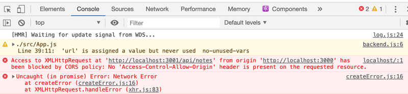

# An Application to the internet

Next , let's connect the frontend we made in <a href="https://github.com/vaishnav-sh/learn-fullstack/tree/master/11%20-%20Node.js%20and%20Express" target="_blank">part 2 to our own backend (server v1)</a>.


In the previous part, the JSON Server that served as the backend provided a list of notes at http://localhost:3001/notes for the frontend to use. The structure of the urls in our backend is slightly different (the notes are at http://localhost:3001/api/notes ), so we change the variable `baseUrl` defined in the frontend file `src/services/notes.js` as follows:

```js
import axios from 'axios'
const baseUrl = 'http://localhost:3001/api/notes' //here

const getAll = () => {
  const request = axios.get(baseUrl)
  return request.then(response => response.data)
}

// ...

export default { getAll, create, update }
````

- The GET request made by the frontend to http://localhost:3001/api/notes does not work for some reason:



- What is it about? However, the backend works without a problem when using a browser and postman.

