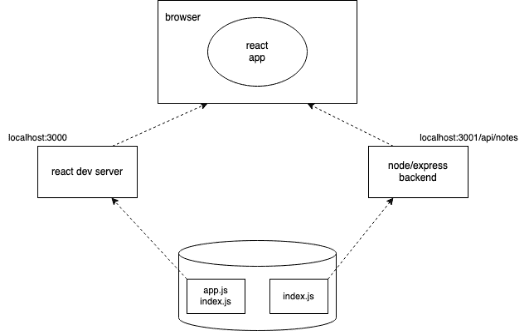

# Same origin policy and CORS

It's about something called CORS, i.e. *Cross-origin resource sharing*. According to Wikipedia:

>Cross-origin resource sharing (CORS) is a mechanism that allows restricted resources (eg fonts) on a web page to be requested from another domain outside the domain from which the first resource was served. A web page may freely Embed cross-origin images, stylesheets, scripts, iframes, and videos. Certain "cross-domain" requests, notably Ajax requests, are forbidden by default by the same-origin security policy.

- In short, in our context it is the following: the JavaScript code executed in the browser of the web application is allowed to communicate only with the server in the same origin by default. **Since the server is on localhost port 3001 and the frontend is on localhost port 3000, their origin is not the same**.

- It should also be emphasized that the <a href="https://developer.mozilla.org/en-US/docs/Web/Security/Same-origin_policy" target="_blank">same origin policy</a> and CORS are by no means React- or Node-specific issues, but universal principles for the operation of web applications.

- We can allow requests from other origins using Node 's <a href="https://github.com/expressjs/cors" target="_blank">cors</a> middleware.

- Installed in the backend (server folder within notes folder) with the cors command 

```
npm install cors
```

- Let's implement the middleware for the time being with a configuration that allows requests from all origins to all express routes of the backend:

```js
const cors = require('cors')

app.use(cors())
```

- Now the frontend works! However, the backend doesn't yet have functionality that makes notes important.

- You can read more about CORS on e.g. <a href="https://developer.mozilla.org/en-US/docs/Web/HTTP/CORS" target="_blank">Mozilla's website</a>.

- The application execution environment now looks like this:



- The frontend code running in the browser therefore retrieves data from the Express server at localhost:3001.


