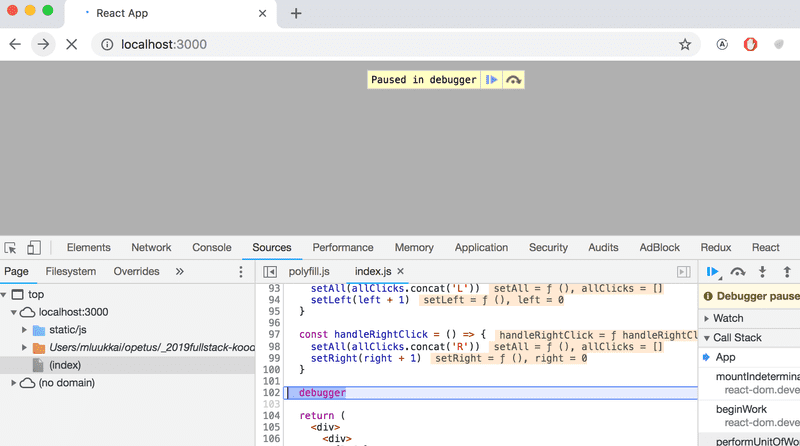

## Debugging React Apps

**The first rule of web development**

- Keep the browser's developer console open at all times.
- The Console tab in particular should always be open, unless there is a specific reason to view another tab.
- Keep both your code and the web page open together at the same time, all the time.
- If and when your code fails to compile and your browser lights up like a Christmas tree:

  

- don't write more code but rather find and fix the problem immediately.
- There has yet to be a moment in the history of coding where code that fails to compile would miraculously start working after writing large amounts of additional code.
- Old school, print-based debugging using `console.log()` is always a good idea.
- Logging to the console is by no means the only way of debugging our applications.
- You can pause the execution of your application code in the Chrome developer console's `debugger`, by writing the command `debugger` anywhere in your code.
- The execution will pause once it arrives at a point where the `debugger` command gets executed:



- By going to the Console tab, it is easy to inspect the current state of variables:


- Once the cause of the bug is discovered you can remove the `debugger` command and refresh the page.
- The debugger also enables us to execute our code line by line with the controls found on the right-hand side of the Sources tab.
- You can also access the debugger without the debugger command by adding breakpoints in the Sources tab. Inspecting the values of the component's variables can be done in the Scope-section:


### **MOVING ON**

It is highly recommended to add the [React developer tools](https://chrome.google.com/webstore/detail/react-developer-tools/fmkadmapgofadopljbjfkapdkoienihi) extension to Chrome. It adds a new Components tab to the developer tools. The new developer tools tab can be used to inspect the different React elements in the application, along with their state and props:


- The `App` component's state is defined like so:

```js
const [left, setLeft] = useState(0);
const [right, setRight] = useState(0);
const [allClicks, setAll] = useState([]);
```

- Dev tools shows the state of hooks in the order of their definition:


- The first State contains the value of the `left` state, the next contains the value of the `right` state and the last contains the value of the `allClicks` state.
