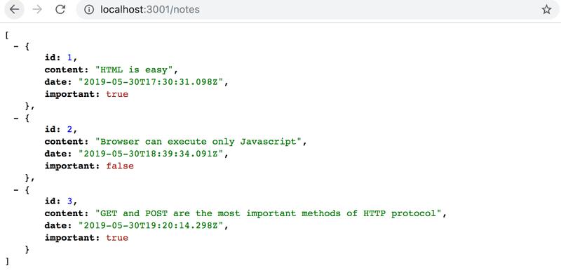

# Introduction

All this time we have been working on the Frontend (i.e. the client-side or browser) functionality. we will now take a step in the direction of adding server-side functionality (backend) by familiarizing ourselves with how code executing in the browser communicates with the backend.

- Let's use a tool meant to be used during software development called JSON Server to act as our server.
- Create a file named `db.json` in the root directory of the project with the following content:

```js
{
  "notes": [
    {
      "id": 1,
      "content": "HTML is easy",
      "date": "2022-1-17T17:30:31.098Z",
      "important": true
    },
    {
      "id": 2,
      "content": "Browser can execute only JavaScript",
      "date": "2022-1-17T18:39:34.091Z",
      "important": false
    },
    {
      "id": 3,
      "content": "GET and POST are the most important methods of HTTP protocol",
      "date": "2022-1-17T19:20:14.298Z",
      "important": true
    }
  ]
}
```

- You can install JSON server globally on your machine using the command `npm install -g json-server`. A global installation requires administrative privileges, which means that it is not possible on the faculty computers or freshman laptops.

- However, a global installation is not necessary. From the root directory of your app, we can run the json-server using the command npx:

```js
npx json-server --port 3001 --watch db.json
```

- The json-server starts running on port 3000 by default; but since projects created using create-react-app reserve port 3000, we must define an alternate port, such as port 3001, for the json-server.

**navigate to the address http://localhost:3001/notes in the browser**



- If your browser doesn't have a way to format the display of JSON-data, then install an appropriate plugin, e.g. [JSONView](https://chrome.google.com/webstore/detail/jsonvue/chklaanhfefbnpoihckbnefhakgolnmc) to make your life easier.

- Going forward, the idea will be to save the notes to the server, which in this case means saving to the json-server

- The React code fetches the notes from the server and renders them to the screen.

- Whenever a new note is added to the application the React code also sends it to the server to make the new note persist in "memory".

- json-server stores all the data in the db.json file, which resides on the server. In the real world, data would be stored in some kind of database.

- However, json-server is a handy tool that enables the use of server-side functionality in the development phase without the need to program any of it.
